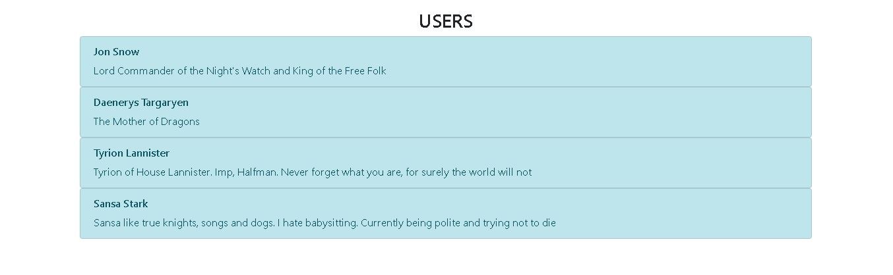
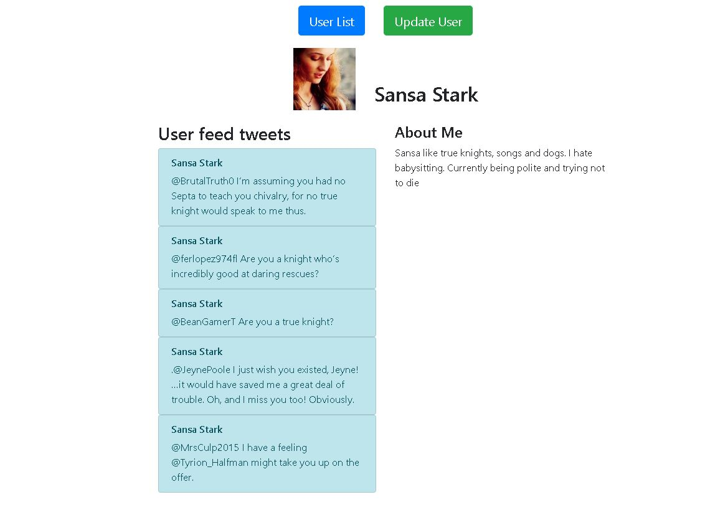
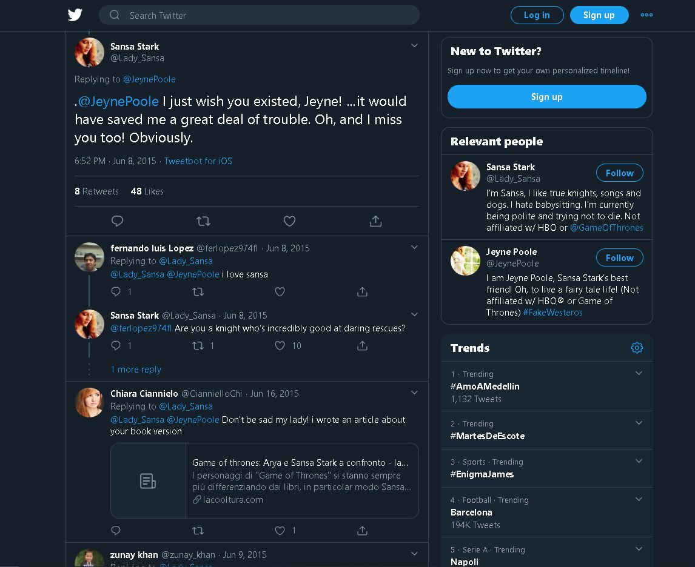
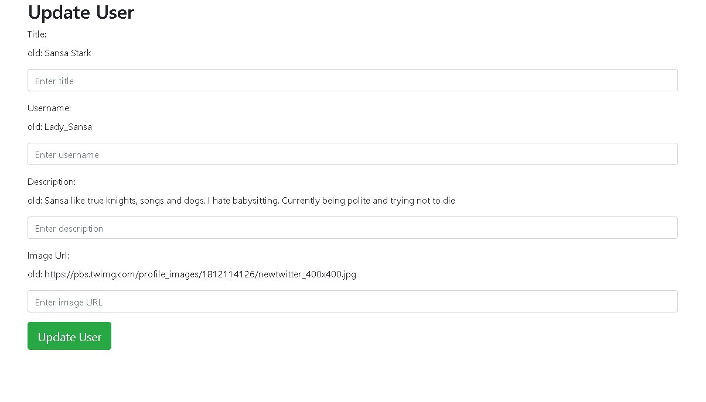

# Portfolio Java Web App

This is a the tech test for the position of Java Developer

## Getting Started

1. Open Git Bash.Change the current working directory to the location where you want the cloned directory to be made.
2. Type: 
```sh
$ git clone https://github.com/Alejandro287/zemoga.app.git
```

3. Change the current working directory to each derectory and run each spring boot project typing the following command:
```sh
$ mvn spring-boot:run
```

### Prerequisites

* JDK 1.8
* Git
* IDE (IntelliJ was used in this case)
* Maven
* MySQL
* Tomcat
* Postman

### Tech Stack 

* JDK 1.8
* Java 8
* Spring Boot 
* Lombok: avoid boilerplate code .
* MySQL: SQL database and its connector with Spring.
* Spring HATEOAS: Implement a Hypermedia Driven RESTful API
* Twitter4j: Connector with Twitter API.
* Project Spring Reactor Webflux: UImplement rective programming and recative oriented API.
* Spring Cloud Config: Externalize configuration of the services.
* Spring Cloud Netflix Eureka: A server registry and service discovery.
* Spring Cloud Netflix Zuul: The Gateway and router to the services.
* Spring Actuator: Expose operational information about the running application
* Ajax/Jquery
* Junit 5
* Fourth level of API RESTful
* Microservices Architecture
* MVC Architecture

## Using of the Frontend side of the application

After running every component of the app, go to portfolio_front and open in your browser the userList.html



You can now navigate to any user profile page. 



From this page you can be redirecto to Twitter posts. 



If you click on the button you will go to another screen to upload the user information.



### Using of the Backend side of the application

### API Documentation

### Diagram of the architecture 

## Deployment

Add additional notes about how to deploy this on a live system

## Built With

* [Dropwizard](http://www.dropwizard.io/1.0.2/docs/) - The web framework used
* [Maven](https://maven.apache.org/) - Dependency Management
* [ROME](https://rometools.github.io/rome/) - Used to generate RSS Feeds

## Versioning

We use [SemVer](http://semver.org/) for versioning. For the versions available, see the [tags on this repository](https://github.com/your/project/tags). 

## Authors

* **Alejandro Cano Rico** - *3134752698* - *alejocano287@gmail.com* - [PurpleBooth](https://github.com/PurpleBooth)

See also the list of [contributors](https://github.com/your/project/contributors) who participated in this project